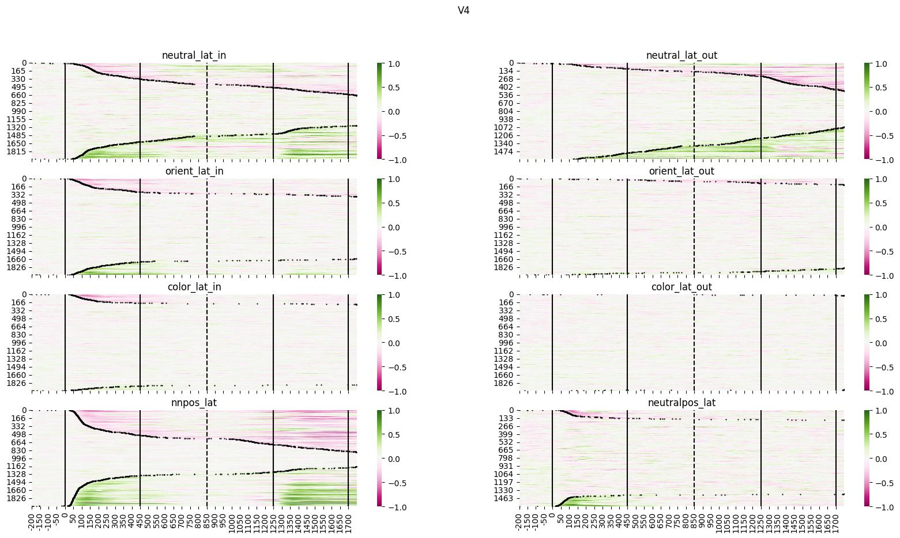

# Results

## Selectivity
Results using non zero and inside 1.5 percentile trials
### All neurons
* V4

* LIP

* PFC

#### Latencies

### Neurons without selectivity to neutral in vs neutral out
* V4

* LIP

* PFC

#### Latencies

### Neurons with selectivity to neutral in vs neutral out
* V4

* LIP

* PFC

#### Latencies

### Conclusion/ideas

